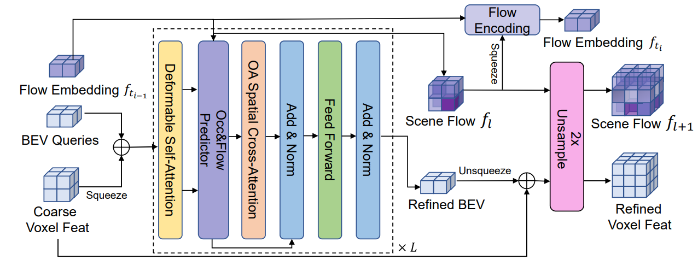

Abstract: In this technical report, we present our solution, named
CascadeFlow, for the Vision-Centric 3D Occupancy and
Flow Prediction track of Autonomous Grand Challenge at
CVPR 2024. Our proposed solution, CascadeFlow, builds
upon CascadeOcc, a cascade sparsity sampling refinement
framework for vision-based occupancy prediction. Based
on CascadeOcc, and considering the scale-invariant and
temporal coherence of scene flow, we propose a flow embedding that learns the relationships between adjacent occupancy in a 3D scene and refines them stage by stage
within the cascade framework. Thanks to the sparse refinement and cascade design, our model achieves high performance: 5th place in RayIoU with a score of 37.8, 2nd place
in MAVE with a score of 0.31, and 5th place in occupancy
score with a score of 40.89. This is accomplished without
the need for test-time augmentation (TTA), post-processing,
or model ensembling, and even with a lightweight setting
requiring only 7.3 GB of memory for training.